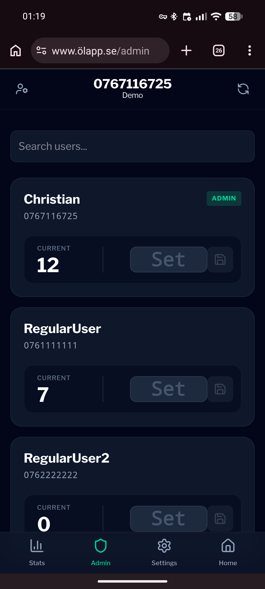
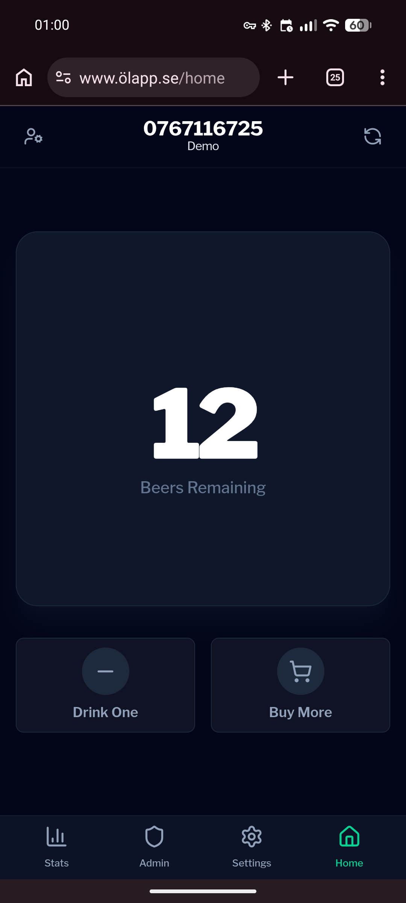

# BeerTrack

BeerTrack is an app designed to track beer consumption during the LTH introductory period. It focuses on a simple, fast, and intuitive user experience.

---

  <table cellspacing="250">
    <tr>
      <td></td>
      <td></td>
    </tr>
  </table>

## Features

### Group system

- Join groups via invite link or invite code
- Tiered permissions: owner, admin, user
- Create, manage, and customize groups easily

### Customization (owner only)

- Set group name
- Configure price per beer
- Add Swish payment number

### Consumption tracking

- 24-hour rolling log of beer consumption
- Admins can add beers to user accounts

---

## Roadmap

- Native Android app
- Native iOS app
- Attendance feature
